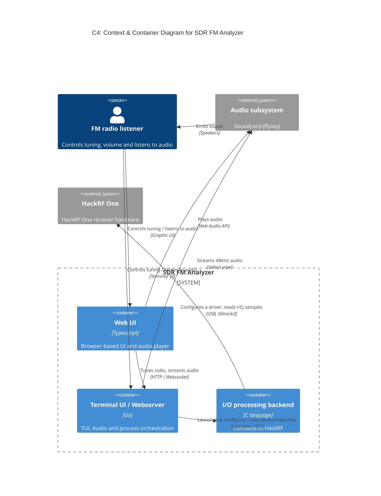

> This document is non-complete and in process of creation

# Introduction and Goals

## Background

With rising of computation power over the last two decades and wide accessability to SIMD architecture in consumer devices,
different engineering approaches have moved from hardware to software. One good example is radio payload
processing on software side, called Software Defined Radio. Instead of modelling hardware circuit, testing, producing,
which are relatively slow processes, building the same logic on software side brings many benefits:

* Fast iteration in research tasks in radio domain
* Fast feedback loop when prototyping a new type of service, device or algorithm 
* Possibility to apply well established Digital Signal Processing algorithms to radio domain  
* Simulate different corner and edge cases while doing verification and validation 

This project uses HackRF One as affordable consumer-level SDR hardware.

## Goals of this project

The are several motivations while working on this project:

- Hand-on learning of Software Defined Radio
    - Signal modulation and de-modulation
    - FM radio station bandwidth layout
- Study fundamentals of Digital Signal Processing approaches and algorithms
- Work with hardware
- Back to C language after pause of a decade
- Form a roadmap in further development in SDR and DSP

## Requirements

### Functional requirements

| Requirement | Title | Description | Importance | Status |
|-|-|-|-|-|
| FR-1 | A user can listen to FM radio station | This is the very basic functionality that requires end-to-end FM signal capturing and decoding | MANDATORY | Implemented |
| FR-2 | A user can tune to FM station of interest |  | MANDATORY | Implemented |
| FR-3 | A user can record an FM station to audio file | To be able to play it later  | OPTIONAL | Implemented |
| FR-4 | A user can tune volume of FM station | | OPTIONAL | NOT implemented |
| FR-5 | A user can see metadata of FM station | FM broadcast stations transmit metadata called RDS (Radio Data System) such as song titles, artist names, and station callsigns  | MANDATORY | NOT implemented |
| FR-6 | A user can explore a list of FM stations available nearby |  | OPTIONAL | NOT implemented |
| FR-7 | Both mono and stereo FM stations should be supported | | MANDATORY | Partly implemented |
| FR-8 | Stereo FM station should be converted into stereo audio | | MANDATORY | NOT implemented |

### Non-functional requirements

| Requirement | Title | Description | Importance | Status |
|-|-|-|-|-|
| NFR-1 | It should be possible for a user to use console and/or Web UIs| | MANDATORY | Partly implemented |

# Architecture Constraints

- Do not use any existing DSP framwork or library, to understand things from the ground
- Do not use any abstraction layer over SDRs, like gr-osmosdr
- The target operation system is Linux
- Use HackRF One hardware as the only available
- Use C languge to work with HackRF driver directly, without any bindings and additional layers

# Context and Scope

## Business context

The SDR FM Analyzer captures radio frequency broadcasts, demodulates commercial FM radio stations and delivers real-time audio and metadata to listeners.

| Actor | Input to System | Output from System | Domain Responsibility |
|:---|--|--|--|
| FM Radio Listener | Tuning frequency, gain levels and volume | Decoded audio (music/voice), RDS metadata (song title, station callsign) | Interacts with UI, provides configuration, listens to broadcasts |
| FM Radio Broadcasters | Over-the-air RF electromagnetic waves (87.5 – 109.0 MHz) | None | Transmit FM multiplex (MPX) signals (Mono, Stereo, RDS) |
| OS Audio Subsystem | None | 48 kHz PCM audio stream | Converts digital audio samples into acoustic sound waves |

## Technical Context

| Interface / Partner | Channel type| Protocol | Data Format / Payload |
|:---|--|--|--|
| HackRF One | USB 2.0 peripheral | `libhackrf` driver API | Interleaved 8-bit signed quadrature pairs (`int8_t` I/Q at 8-20 MSPS) |
| Audio Subsystem (ffplay / ALSA) | Linux OS Pipe (`stdout`) | Unix stream pipe, 64Kb buffer | 48 kHz, 16-bit signed little-endian PCM (`int16_t` mono/stereo) |
| Terminal UI (Go) | Host terminal | ANSI / VT100, `stdin/stderr` | Text commands, telemetry strings |
| Web UI (Browser) | Local network / loopback | HTTP + WebSockets | HTML/JS assets, JSON control messages, Web Audio streams |

### Context & Container Diagram

## Technical Context

# Solution Strategy

# Building Block View

# Runtime View

# Deployment View

# Cross-cutting Concepts

# Architecture Decisions

- Split DSP pipeline into modules: to apply asynchronous and decoupled data processing to allow data handling at different rates and allow sclaing
- Use Ring Buffer to consume data from HackRF One driver 

# Quality Requirements

### QR-1: DSP pipeline should work smoothly on avarage laptop/desktop hadrware
* Latency: real-time audio playback latency is < 200 ms buffer delay
* Resource limits: CPU utilization < 30% on a standard 2-core x86_64 laptop at 2.0 MSPS I/Q input rate
* Robustness: Zero audio glitches under steady-state operation

TODO: add testable scenarios

# Risks and Technical Debts

The initial prototype has revealed a number of risks that should be addressed or minimized in the final solution.

| Risk | Severity | Description | Mitigation
|--|--|--|--|
| Ring buffer overflow | Low | If DSP part is slow compared to HackRF raw I/Q transfering speed, the buffer will be full. This sould not lead to a buffer overflow problem | Log warning, discard oldest samples, reproduce with unit tests
| I/Q data loss due to a Unix pipe backpressure| High | When consuming party is slow (e.g. audio output), it can not cosume data at the same speed as HackRF produces and DSP processes it, leading to a full Linux kernel pipe 64 Kb buffer with stopping data transferring | Consuming party should work fast and be configured properly
| Lack of CPU computational resources or data transfering speed | Medium | | Use performance tests and log execution over time to be able to visually assess the performance
| Desynchronization of different algorithms | High | Different algorythms in DSP pipline require different decimation, work against different RF frequencies and use different demodulation technics (e.g. sound vs metadata) | This should be part of the technical design. Use intergation tests with decent number of scenarious.

