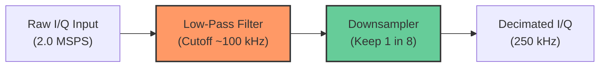

# FAQ: Downsampling and Decimation in SDR

This document explains the principles, mathematics, and implementation techniques for downsampling high-rate raw I/Q samples (e.g., $2\text{ MSPS}$ from HackRF One) down to an intermediate bandwidth ($\sim 200\text{–}250\text{ kHz}$) before FM demodulation.

---

## 1. What is Downsampling (Decimation)?

Downsampling (or **Decimation**) reduces the sampling rate of a digital signal.

To transition from an input rate of **$f_{\text{in}} = 2,000,000\text{ SPS}$ ($2\text{ MSPS}$)** down to an intermediate rate of **$f_{\text{out}} = 250,000\text{ SPS}$ ($250\text{ kHz}$)**, we determine the integer decimation factor $M$:

$$M = \frac{f_{\text{in}}}{f_{\text{out}}} = \frac{2,000,000}{250,000} = \mathbf{8}$$

This means that for every **$8$ input samples**, we compute and retain exactly **$1$ output sample**.

---

## 2. Why $250\text{ kHz}$ Intermediate Bandwidth?

1. **Matches Commercial FM Channel Width:** Standard broadcast FM stations occupy approximately $\mathbf{200\text{ kHz}}$ of bandwidth (containing mono audio, $19\text{ kHz}$ stereo pilot tone, stereo difference audio, and $57\text{ kHz}$ RDS data). A $250\text{ kHz}$ sample rate comfortably captures the entire channel while filtering out adjacent stations.
2. **Massive CPU Savings:** The downstream FM demodulator computes computationally expensive inverse tangents ($\text{atan2f}$). Running demodulation at $250\text{ kHz}$ requires **$87.5\%$ fewer calculations** than running it at the raw $2\text{ MSPS}$ rate ($250,000\text{ ops/sec}$ vs. $2,000,000\text{ ops/sec}$).

---

## 3. The Golden Rule: Anti-Aliasing Filter

A common mistake in digital signal processing is simply keeping 1 sample out of every $M$ without prior filtering:

```text
INCORRECT:
Input Samples:  [s0, s1, s2, s3, s4, s5, s6, s7, s8, s9, ...]
Discard:             x   x   x   x   x   x   x       x
Result:         [s0,                             s8,     ...]  <-- Corrupted by Aliasing!
```

### Why Naive Decimation Fails: The Nyquist-Shannon Theorem
At a new sampling rate of $f_{\text{out}} = 250\text{ kHz}$, the maximum unaliased frequency span is:
$$f_{\text{Nyquist}} = \frac{f_{\text{out}}}{2} = \pm 125\text{ kHz}$$

Any signal, noise, or adjacent broadcast existing between $125\text{ kHz}$ and $1\text{ MHz}$ does not vanish; instead, it **folds back (aliases)** into the baseband, permanently corrupting the desired audio signal.

Therefore, decimation **must always** be a two-step operation:

$$\mathbf{\text{Decimation}} = \mathbf{\text{Low-Pass Anti-Aliasing Filter}} + \mathbf{\text{Downsample (keep 1 of } M\text{)}}$$



---

## 4. Implementation Methods

### Method A: Boxcar / Moving-Average Decimator (Fast & Simple)

The simplest anti-aliasing filter sums a block of $M$ consecutive samples and divides by $M$:

```c
#define DECIM_FACTOR 8

size_t out_idx = 0;
for (size_t i = 0; i + DECIM_FACTOR <= num_samples; i += DECIM_FACTOR) {
    float sum_i = 0.0f;
    float sum_q = 0.0f;

    for (int k = 0; k < DECIM_FACTOR; k++) {
        sum_i += in_i[i + k];
        sum_q += in_q[i + k];
    }

    out_i[out_idx] = sum_i / (float)DECIM_FACTOR;
    out_q[out_idx] = sum_q / (float)DECIM_FACTOR;
    out_idx++;
}
```

* **Advantages:** Extremely fast; requires no floating-point multiplications or precomputed coefficient tables.
* **Limitations:** The frequency response follows a $\text{sinc}$ curve ($\frac{\sin x}{x}$), which exhibits relatively slow stopband roll-off and mild droop at higher audio frequencies.

---

### Method B: Finite Impulse Response (FIR) Filter with Polyphase Decimation (High-Fidelity)

For steep attenuation of out-of-band signals, a symmetric low-pass **FIR filter** is the industry standard:

$$y[n] = \sum_{k=0}^{N-1} h[k] \cdot x[n - k]$$

Where $h[k]$ are precalculated filter coefficients (taps).

#### The Polyphase Optimization
In standard filtering, convolution is calculated for every input sample. When combined with decimation by $M = 8$, **we only evaluate the convolution for the one sample we actually keep**. The remaining 7 output calculations are simply skipped:

```text
Sample Index:   0   1   2   3   4   5   6   7   8   9  10  11  12  13  14  15
Calculate FIR? YES  no  no  no  no  no  no  no YES  no  no  no  no  no  no  no
```

#### Example: 15-Tap FIR Decimator in C

```c
#define TAPS 15
#define DECIM_M 8

/* Precomputed symmetric low-pass filter taps (Cutoff ~100 kHz at 2 MSPS) */
static const float FIR_COEFFS[TAPS] = {
   -0.003f, -0.008f,  0.000f,  0.035f,  0.098f,  0.172f,  0.226f,  0.245f,
    0.226f,  0.172f,  0.098f,  0.035f,  0.000f, -0.008f, -0.003f
};

size_t out_count = 0;
for (size_t i = TAPS; i < num_input_samples; i += DECIM_M) {
    float acc_i = 0.0f;
    float acc_q = 0.0f;

    /* Compute dot-product only on every 8th sample */
    for (int k = 0; k < TAPS; k++) {
        acc_i += FIR_COEFFS[k] * in_i[i - k];
        acc_q += FIR_COEFFS[k] * in_q[i - k];
    }

    out_i[out_count] = acc_i;
    out_q[out_count] = acc_q;
    out_count++;
}
```

---

## 5. Summary of Benefits

| Feature | Raw Rate ($2\text{ MSPS}$) | Decimated Rate ($250\text{ kHz}$) |
| :--- | :--- | :--- |
| **Sample Rate** | $2,000,000\text{ samples/sec}$ | $250,000\text{ samples/sec}$ |
| **Nyquist Bandwidth** | $\pm 1,000\text{ kHz}$ | $\pm 125\text{ kHz}$ |
| **Channel Selectivity** | Wide spectrum (contains adjacent stations) | Isolated single FM station |
| **Demodulator Workload** | $2,000,000\text{ atan2f calls/sec}$ | $250,000\text{ atan2f calls/sec}$ (87.5% reduction) |

---

## 6. Pre-Generating FIR Coefficients with Python

In production SDR code, FIR filter coefficients are rarely calculated at runtime on the device. Instead, they are **pre-generated offline using e.g. Python** and pasted into C source code as a `static const float` array.

### A. Python Script using `scipy.signal.firwin`

The standard tool for generating windowed-sinc FIR filters in Python is `scipy.signal.firwin`:

```python
#!/usr/bin/env python3
"""
Generate C-compatible FIR low-pass filter coefficients.
Requires: pip install numpy scipy
"""
import numpy as np
from scipy.signal import firwin

# Filter Specifications
NUM_TAPS = 15          # Must be an odd number for symmetric linear phase
CUTOFF_HZ = 100_000    # 100 kHz (±100 kHz covers 200 kHz FM station)
SAMPLE_RATE = 2_000_000 # 2 MSPS input from HackRF
WINDOW = 'hamming'     # Window function: 'hamming', 'blackman', or 'hann'

# 1. Calculate FIR coefficients (normalized to 0 dB at DC)
taps = firwin(
    numtaps=NUM_TAPS,
    cutoff=CUTOFF_HZ,
    fs=SAMPLE_RATE,
    window=WINDOW,
    pass_zero='lowpass'
)

# 2. Format and print as C static const array
print(f"/* {NUM_TAPS}-Tap Low-Pass FIR Filter */")
print(f"/* Cutoff: {CUTOFF_HZ/1e3:.1f} kHz | Sample Rate: {SAMPLE_RATE/1e6:.1f} MSPS | Window: {WINDOW} */")
print(f"static const float FIR_COEFFS[{NUM_TAPS}] = {{")

# Print 4 coefficients per line with clean indentation
for i in range(0, NUM_TAPS, 4):
    chunk = taps[i:i+4]
    formatted = ", ".join(f"{c:+.6f}f" for c in chunk)
    trailing_comma = "," if i + 4 < NUM_TAPS else ""
    print(f"    {formatted}{trailing_comma}")

print("};")
```

### B. Example Output Generated by the Script

Running the script outputs ready-to-use C code:

```c
/* 15-Tap Low-Pass FIR Filter */
/* Cutoff: 100.0 kHz | Sample Rate: 2.0 MSPS | Window: hamming */
static const float FIR_COEFFS[15] = {
    -0.003182f, -0.008451f, +0.000000f, +0.035412f,
    +0.098205f, +0.171891f, +0.226344f, +0.245562f,
    +0.226344f, +0.171891f, +0.098205f, +0.035412f,
    +0.000000f, -0.008451f, -0.003182f
};
```

Notice the **exact symmetry** around the center tap `FIR_COEFFS[7] = +0.245562f`. This symmetry guarantees **linear phase response**, meaning all audio frequencies experience the exact same time delay through the filter, preventing phase distortion.

---

### C. Visualizing the Filter Response in Python

Before using the coefficients in C, you can verify the attenuation and cutoff using `scipy.signal.freqz` and `matplotlib`:

```python
import matplotlib.pyplot as plt
from scipy.signal import freqz

# Calculate frequency response
w, h = freqz(taps, worN=8000, fs=SAMPLE_RATE)

# Plot magnitude in decibels (dB)
plt.figure(figsize=(10, 5))
plt.plot(w / 1e3, 20 * np.log10(np.abs(h)), 'b')
plt.title(f"FIR Low-Pass Filter Frequency Response ({NUM_TAPS} Taps)")
plt.xlabel("Frequency (kHz)")
plt.ylabel("Magnitude (dB)")
plt.grid(True)
plt.axvline(CUTOFF_HZ / 1e3, color='r', linestyle='--', label=f'Cutoff ({CUTOFF_HZ/1e3:.0f} kHz)')
plt.axvline(125, color='orange', linestyle=':', label='New Nyquist (125 kHz)')
plt.ylim(-60, 5)
plt.legend()
plt.show()
```

### Key Parameter Guidelines:
* **`numtaps` (Filter Order):** Higher taps (e.g. 31 or 63) create a much steeper cutoff (better out-of-band rejection), at the cost of more multiply-accumulate operations per decimated sample. For $M = 8$, 15 to 31 taps is typically the sweet spot.
* **`window`:** 
  * `'hamming'`: Good compromise between transition width and stopband rejection ($\approx -53\text{ dB}$).
  * `'blackman'`: Wider transition band, but extremely deep stopband suppression ($\approx -74\text{ dB}$).

