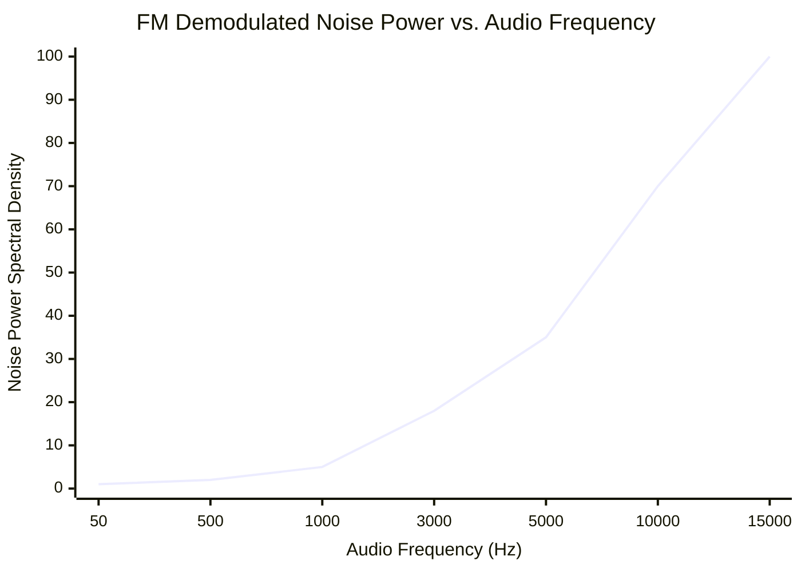
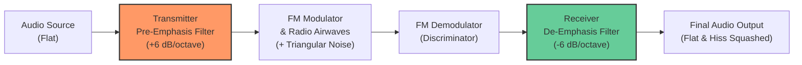
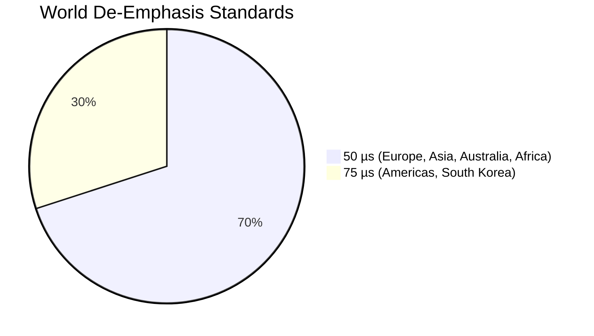

# FAQ: FM Noise, Pre-Emphasis, and De-Emphasis Filtering

This document explains why broadcast FM requires **de-emphasis filtering**, the physics of **triangular FM noise**, and how the single-pole IIR filter coefficient is mathematically derived for digital receivers.

---

## 1. Why Name It "De-Emphasis" vs. "Background Noise"?

While **triangular background noise** is the physical problem, **Pre-Emphasis and De-Emphasis** is the standard telecommunication solution and the exact name of the DSP filter:

* **Pre-Emphasis:** Transmitter boosts high audio frequencies before broadcasting.
* **De-Emphasis:** Receiver rolls off high audio frequencies (turns down the volume of the treble) to restore balance and eliminate noise.

---

## 2. The Physics: Triangular FM Noise Spectrum

In Frequency Modulation (FM), information is encoded in instantaneous frequency deviations. When thermal Gaussian white noise mixes with an FM signal during transmission, the FM demodulator computes phase derivatives ($\frac{d\theta}{dt}$).

Differentiating noise in the time domain multiplies the noise spectrum by frequency ($\omega$) in the frequency domain. As a result, **noise power increases quadratically with frequency ($N(f) \propto f^2$)**:



### The Consequence
* Low audio frequencies ($50\text{–}1000\text{ Hz}$, like bass and vocals) have very little noise.
* High audio frequencies ($5\text{–}15\text{ kHz}$, like cymbals, crisp consonants, and high instruments) suffer from **severe background hiss**.

---

## 3. The Solution: Pre-Emphasis + De-Emphasis

To solve triangular noise without altering the sound of the broadcast, stations and receivers work as a coordinated pair:



1. **At the Transmitter (Pre-Emphasis):** High frequencies are amplified with a high-pass filter before modulation.
2. **In Transit:** The signal picks up triangular high-frequency hiss over the air.
3. **At the SDR Receiver (De-Emphasis):** The demodulated audio passes through a low-pass filter with the exact opposite curve.
4. **The Benefit:** High audio frequencies return to their original volume, while the airwave hiss is **attenuated by up to 13 dB**, resulting in clean FM audio.

---

## 4. Regional Standards: $50\,\mu\text{s}$ vs. $75\,\mu\text{s}$

In analog circuitry, this filter is an $RC$ low-pass circuit governed by its time constant:
$$\tau = R \times C$$

The cutoff frequency where attenuation begins ($3\text{ dB}$ down) is:
$$f_c = \frac{1}{2\pi \tau}$$



| Region | Time Constant ($\tau$) | Cutoff Frequency ($f_c$) |
| :--- | :--- | :--- |
| **Europe, Asia, Australia, Africa** | **$50\,\mu\text{s}$** ($0.000050\text{ s}$) | $\approx 3.18\text{ kHz}$ |
| **Americas (US/Canada), South Korea** | **$75\,\mu\text{s}$** ($0.000075\text{ s}$) | $\approx 2.12\text{ kHz}$ |

---

## 5. Mathematical Derivation of the IIR Filter Coefficient

In digital audio processing, we implement a **Single-Pole IIR Low-Pass Filter** (an exponential moving average / leaky integrator):

$$y[n] = y[n-1] + \alpha \cdot (x[n] - y[n-1])$$

Where:
* $x[n]$ is the raw demodulated sample.
* $y[n]$ is the filtered audio sample.
* $y[n-1]$ is the filter's previous state.
* $\alpha$ is the filter blending factor ($0 < \alpha < 1$).

### Deriving $\alpha$
A continuous $RC$ filter decays over time as $e^{-t/\tau}$. For a discrete sample rate $f_s$, the time step between consecutive samples is $\Delta t = \frac{1}{f_s}$.

The decay factor between samples is:
$$\beta = e^{-\frac{\Delta t}{\tau}} = e^{-\frac{1}{f_s \cdot \tau}}$$

The blending coefficient $\alpha$ is:
$$\alpha = 1 - \beta = 1 - e^{-\frac{1}{f_s \cdot \tau}}$$

In C code:
```c
float tau = deemphasis_us * 1e-6f;
float alpha = 1.0f - expf(-1.0f / ((float)sample_rate * tau));
```

---

## 6. Why Precompute $\alpha$ Ahead of Time?

* `expf()` takes dozens of CPU cycles to calculate.
* Audio sample rate ($48\text{ kHz}$) and time constant ($50\,\mu\text{s}$) are constant during playback.
* Calculating $\alpha$ **once at initialization** allows the inner processing loop to execute with just **one subtraction, one multiplication, and one addition** per audio sample:

```c
// Applied inside the audio processing loop:
deemphasis_state += alpha * (in_sample - deemphasis_state);
```
