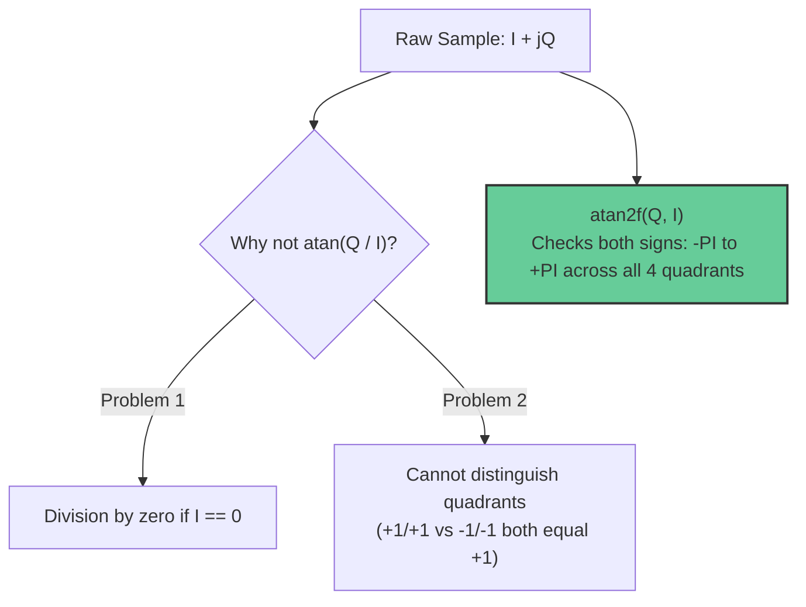

# FAQ: FM Demodulation with `atan2` and the Polar Discriminator

This document explains the physics of **Frequency Modulation (FM) demodulation**, why the trigonometric `atan2` function is used to calculate phase angles, how the **polar discriminator** computes angle differences using a single call, and why demodulation is performed after decimation.

---

## 1. The Physics of FM: Frequency is Phase Velocity

In analog radio transmissions:
* **AM (Amplitude Modulation):** Sound amplitude is directly encoded in the *height / voltage* of the carrier wave.
* **FM (Frequency Modulation):** Sound amplitude is encoded in the **instantaneous frequency deviation** (how much the wave speeds up or slows down relative to the carrier frequency).

Mathematically, frequency $f(t)$ is the **time derivative (rate of change) of the phase angle $\theta(t)$**:

$$f(t) = \frac{1}{2\pi} \frac{d\theta(t)}{dt}$$

In digital signal processing with discrete time steps ($T_s = \frac{1}{f_s}$), the derivative becomes a simple **difference between two consecutive sample angles**:

$$\text{Audio Signal Amplitude} \propto \Delta\theta[n] = \theta[n] - \theta[n-1]$$

```text
       Sample n-1                    Sample n
           Q                            Q
           ▲                            ▲
           │   / (θ[n-1])               │     | (θ[n])
           │  /                         │     |
           │ /                          │     |
───────────┼──────────► I    ───────────┼─────┴────► I

           The angle difference Δθ = θ[n] - θ[n-1] 
           IS your demodulated audio sound wave!
```

* **Loud sound:** The transmitter swings frequency far away from center $\implies \Delta\theta$ is large.
* **Silence (no audio):** The transmitter stays exactly on carrier $\implies$ phase rotates at a constant rate $\implies \Delta\theta = 0$.

---

## 2. Why `atan2` Instead of `atan`?

In complex baseband, each sample is a 2D vector in the complex Cartesian plane:
$$s[n] = I[n] + jQ[n]$$

From basic trigonometry:
$$\tan(\theta) = \frac{\text{Opposite}}{\text{Adjacent}} = \frac{Q}{I} \implies \theta = \arctan\left(\frac{Q}{I}\right)$$



* **Standard `atan(Q / I)`:** Fails if $I = 0$ (division by zero), and only returns angles in a $180^\circ$ range ($-\pi/2$ to $+\pi/2$). It cannot differentiate between $(+1, +1) = 45^\circ$ and $(-1, -1) = -135^\circ$.
* **`atan2f(Q, I)`:** Inspects the signs of both $Q$ and $I$, safely handles $I = 0$, and returns the true angle across the full $360^\circ$ circle ($-\pi$ to $+\pi$).

---

## 3. The "Polar Discriminator" Optimization (1 `atan2` Call)

A naive implementation might calculate the angle of both samples and subtract them:
$$\Delta\theta = \text{atan2f}(Q[n], I[n]) - \text{atan2f}(Q[n-1], I[n-1])$$

However, this naive approach has two severe flaws:
1. **Slow:** It requires **two** expensive `atan2f` calls per sample.
2. **Phase Wrapping Bugs:** If sample $n-1$ is at $+175^\circ$ and sample $n$ wraps around to $-175^\circ$, simple subtraction yields $-350^\circ$ instead of the true $+10^\circ$ change, creating loud audible popping sounds.

### The Solution: Complex Conjugate Multiplication
In complex arithmetic, multiplying vector $A$ by the complex conjugate of vector $B$ ($B^*$) produces a new vector whose angle is **the exact angular difference $\theta_A - \theta_B$**:

$$s[n] \cdot s^*[n-1] = (I_n + jQ_n) \cdot (I_{n-1} - jQ_{n-1})$$

Expanding the multiplication:
$$s[n] \cdot s^*[n-1] = \underbrace{(I_n I_{n-1} + Q_n Q_{n-1})}_{\text{Real Part}} + j \underbrace{(Q_n I_{n-1} - I_n Q_{n-1})}_{\text{Imaginary Part}}$$

Taking the `atan2f` of this single resulting vector yields the exact angle difference:

$$\mathbf{\Delta\theta = \text{atan2f}(Q_n I_{n-1} - I_n Q_{n-1}, \; I_n I_{n-1} + Q_n Q_{n-1})}$$

### Why This is the Gold Standard in SDR:
1. **Twice as fast:** Only **one** `atan2f` call per sample.
2. **Zero phase-wrapping bugs:** The trigonometric difference naturally computes the shortest angular path without jumping across $\pm\pi$.

---

## 4. Implementation in C

Inside the processing loop:

```c
// Current complex sample at index n: (in_i, in_q)
// Previous complex sample at index n-1: (prev_i, prev_q)

// Complex conjugate multiplication: s[n] * s*[n-1]
float real_part = in_i * prev_i + in_q * prev_q;
float imag_part = in_q * prev_i - in_i * prev_q;

// Demodulated audio amplitude (instantaneous frequency deviation):
float d_theta = atan2f(imag_part, real_part);

// Store current sample for next iteration
prev_i = in_i;
prev_q = in_q;
```

---

## 5. Why Demodulate AFTER Decimation?

| Consideration | Before Decimation ($2\text{ MSPS}$) | After Decimation ($250\text{ kHz}$) |
| :--- | :--- | :--- |
| **`atan2f` calls/second** | $2,000,000\text{ ops/sec}$ | $250,000\text{ ops/sec}$ (**87.5% CPU reduction**) |
| **Signal Purity** | Noisy wideband spectrum | Clean, filtered $200\text{ kHz}$ FM channel |
| **Phase Stability** | High noise vectors flutter phase | Filtered vectors produce clean audio |

By performing decimation first, the low-pass channel filter eliminates out-of-band interference, allowing the polar discriminator to calculate smooth, distortion-free phase deltas at a fraction of the computational cost.
