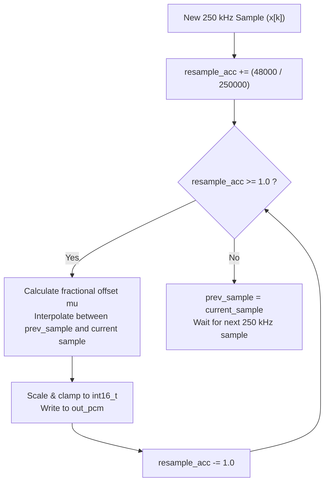

# FAQ: Fractional Resampling (250 kHz to 48 kHz Audio)

This document explains why converting an intermediate FM sample rate ($250\text{ kHz}$) to a standard audio sample rate ($48\text{ kHz}$) requires **fractional resampling**, the mathematics of **linear interpolation**, and how to implement it cleanly in C using a phase/time accumulator.

---

## 1. The Core Problem: Non-Integer Sample Ratios

When converting sample rates, integer decimation works only if the input rate is an exact multiple of the output rate (e.g. $2\text{ MSPS} / 8 = 250\text{ kHz}$).

However, when converting from an intermediate rate of **$250\text{ kHz}$** to the standard sound card rate of **$48\text{ kHz}$**, the ratio is:

$$\text{Ratio} = \frac{f_{\text{in}}}{f_{\text{out}}} = \frac{250,000}{48,000} = \frac{125}{24} \approx \mathbf{5.208333\dots}$$

Because **$5.208333$ is not an integer**, you cannot simply pick every $N$-th sample:
* **Pick every 5th sample:** Results in $50\text{ kHz}$ ($4.1\%$ too fast $\implies$ pitch increases by nearly a semitone, sounds like a "chipmunk", causes sound-card buffer underruns).
* **Pick every 6th sample:** Results in $41.67\text{ kHz}$ ($13\%$ too slow $\implies$ pitch drops, sound is sluggish and dragged down).

To produce **exact $48\text{ kHz}$ audio**, we must synthesize waveform points that fall at **fractional positions between discrete input samples**:

```text
Input Samples (250 kHz):     [0]       [1]       [2]       [3]       [4]       [5]       [6]
                              │                                                 │         │
Desired 48 kHz Output:        ▼                                                 └────▲────┘
                           Output 0                                               Output 1
                           (at 0.0)                                             (at 5.208!)
```

---

## 2. Method 1: Linear Interpolation (Fast, Lightweight & Effective)

In software defined radio, the most common and efficient solution is **Linear Interpolation**.

When the desired output time $t$ falls between two known discrete samples $x[k]$ and $x[k+1]$:
* **Integer Index:** $k = 5$
* **Fractional Distance:** $\mu = 0.208333$ (where $0.0 \le \mu < 1.0$)

The interpolated value $y$ is a weighted blend between the two neighboring samples:

$$y = (1.0 - \mu) \cdot x[k] + \mu \cdot x[k+1]$$

```text
Amplitude
  ▲
  │                     x[k+1]
  │                       ●
  │                   ▲
  │                 / │
  │        x[k]   /   │ (Interpolated value y)
  │         ●───/─────┼───────
  │         │   │  μ  │
  └─────────┴───┴─────┴───────► Time
            k       k+1
```

---

## 3. How to Implement It with a Time Accumulator in C

Similar to the phase accumulator used in the frequency mixer, we track fractional time using an **accumulator**:

* **Step Ratio:** $\text{ratio} = \frac{f_{\text{out}}}{f_{\text{in}}} = \frac{48,000}{250,000} = \mathbf{0.192f}$.
* On every incoming $250\text{ kHz}$ sample, we advance the accumulator by `0.192f`.
* Whenever the accumulator crosses $\ge 1.0$, a new $48\text{ kHz}$ audio output sample is produced, and $1.0$ is subtracted.



### Generic C Implementation

```c
/* Resampler state */
typedef struct {
    float acc;           /* Fractional position accumulator */
    float prev_sample;   /* Previous input sample x[n-1] */
    float ratio;         /* Output rate / Input rate (e.g., 48000 / 250000 = 0.192) */
} linear_resampler_t;

void resampler_init(linear_resampler_t *r, float in_rate, float out_rate) {
    r->acc = 0.0f;
    r->prev_sample = 0.0f;
    r->ratio = out_rate / in_rate;
}

/* Process one input sample; generates 0, 1, or more interpolated output samples */
size_t resampler_process_sample(linear_resampler_t *r, float in_sample,
                                float *out_samples, size_t max_out) {
    size_t count = 0;
    r->acc += r->ratio;

    while (r->acc >= 1.0f && count < max_out) {
        /* Fractional distance between previous and current sample */
        float mu = 1.0f - (r->acc - 1.0f);

        /* Linear interpolation: y = (1 - mu) * x[n-1] + mu * x[n] */
        out_samples[count++] = (1.0f - mu) * r->prev_sample + mu * in_sample;

        r->acc -= 1.0f;
    }

    r->prev_sample = in_sample;
    return count;
}
```

---

## 4. Method 2: Polyphase FIR Resampling (Studio Quality)

For high-end audiophile applications (such as GNU Radio or SDR#):
* The fraction $\frac{48,000}{250,000}$ reduces to the irreducible fraction $\frac{24}{125}$.
* **Theoretical Pipeline:**
  1. **Interpolation (Upsampling by 24):** Insert 23 zeros between samples $\to 6.0\text{ MHz}$.
  2. **Anti-Imaging Filter:** Low-pass filter at $6.0\text{ MHz}$ to remove spectral replicas.
  3. **Decimation (Downsampling by 125):** Retain every 125th sample $\to 48\text{ kHz}$.
* To avoid running a high-tap filter at $6\text{ MHz}$, a **polyphase filter bank** splits the filter into 24 parallel sub-filters.

### Summary Comparison:

| Feature | Linear Interpolation | Polyphase FIR Resampler |
| :--- | :--- | :--- |
| **Complexity** | ~10 lines of C | Complex filter bank |
| **CPU Cost** | Negligible ($\sim 2$ ops/output) | Moderate (dozens of MACs/sample) |
| **Memory Footprint** | 2 floats | Coefficient tables + state history |
| **Audio Quality** | Clear, natural sound (ideal for broadcast voice/music) | Bit-perfect studio grade |
