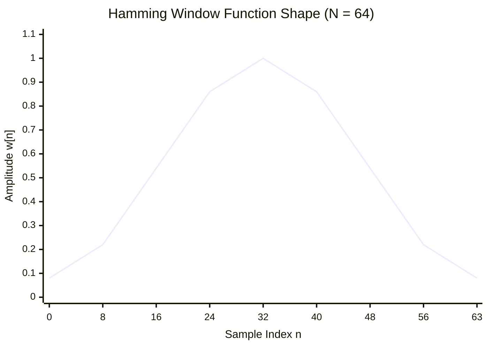
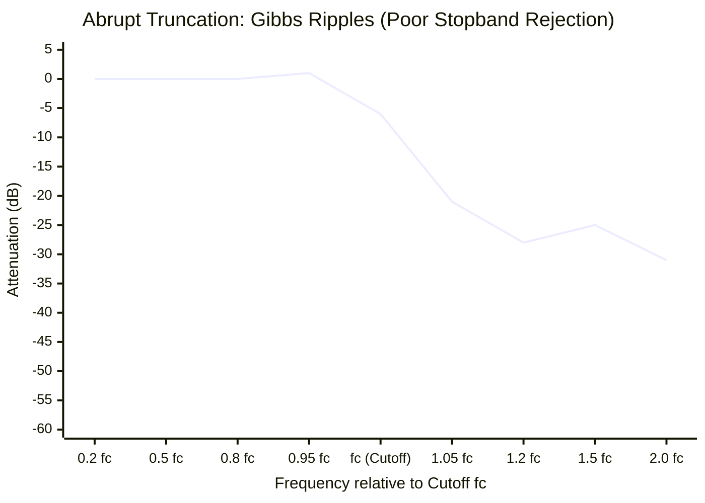
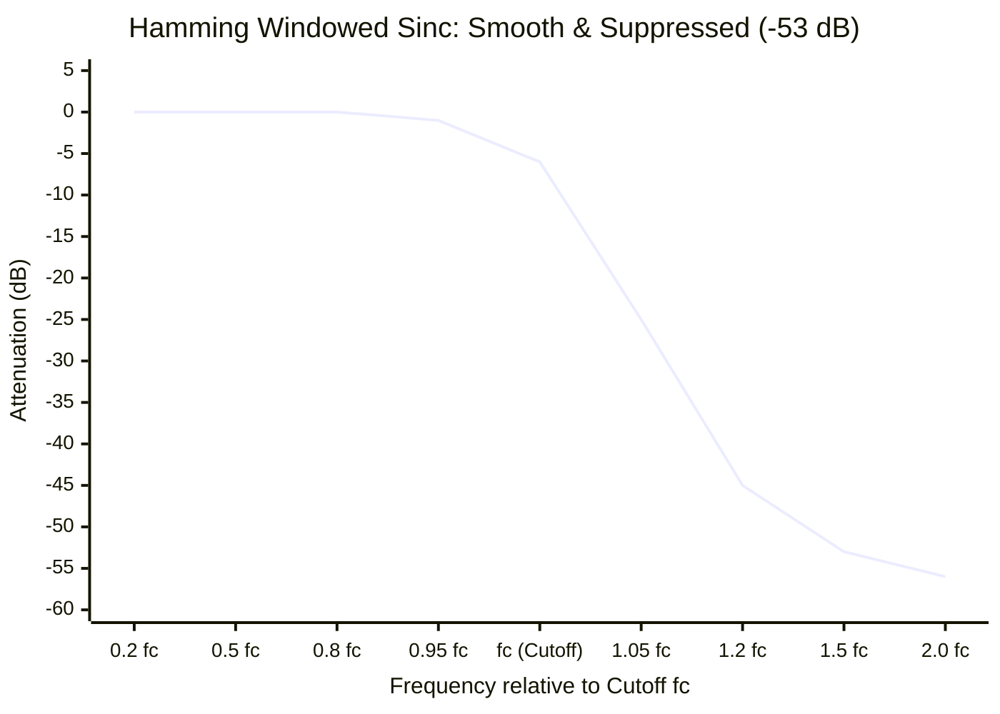
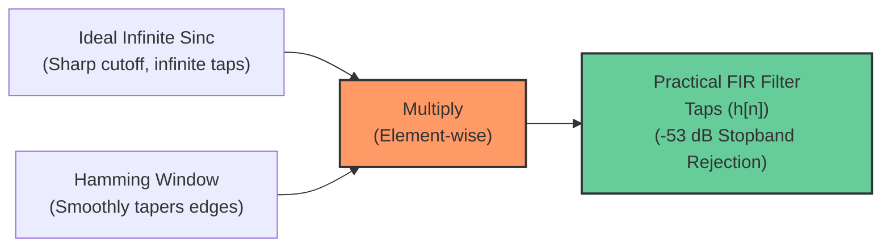

# FAQ: What is a Hamming Window and How is it Used in FFT & FIR Filter Design?

A **Window Function** is a mathematical curve that smoothly tapers the edges of a finite block of samples down towards zero. The **Hamming Window** is one of the most famous and widely used window functions in digital signal processing (DSP).

---

## 1. The Core Problem: The Danger of "Rectangular Truncation"

In computer systems, we cannot process an infinite signal. We must always take a finite slice of $N$ samples.

If you simply take $N$ samples and do nothing else, you are implicitly applying a **Rectangular Window** (multiplying the chosen $N$ samples by $1.0$ and everything outside by $0.0$).

```text
Continuous Waveform:  ~~~/\~~/\~~/\~~/\~~/\~~/\~~/\~~~
Finite Sliced Block:  ┌──────────────────────────────┐
                      │    /\  /\  /\  /\  /\        │  <-- Sudden, harsh edges!
                      └──────────────────────────────┘
```

### The Frequency-Domain Consequence
A fundamental rule of Fourier analysis states:
$$\text{Multiplication in Time Domain} \iff \text{Convolution in Frequency Domain}$$

The Fourier transform of a sharp rectangle in time is a **Sinc function ($\frac{\sin x}{x}$)** in frequency. Sinc functions have large oscillating "side lobes" that decay very slowly (only $-13\text{ dB}$ down). 

These sharp edges introduce severe mathematical artifacts into both **FIR filters** and **FFT spectrum analysis**.

---

## 2. The Hamming Window: Formula & Shape

In the 1950s, mathematician **Richard W. Hamming** (Bell Labs) discovered that by using a raised cosine curve with specifically tuned coefficients, the first and largest side-lobe of the sinc spectrum could be **almost perfectly cancelled out**.

### The Mathematical Formula

$$w[n] = 0.54 - 0.46 \cdot \cos\left(\frac{2\pi n}{N - 1}\right), \quad 0 \le n \le N - 1$$



* **Center ($n = \frac{N-1}{2}$):** Reaches maximum gain of $1.00$ ($0.54 + 0.46$).
* **Edges ($n = 0$ and $n = N-1$):** Tapers down to $0.08$ ($0.54 - 0.46$).

*(Note: The closely related **Hann window** uses $0.50 - 0.50\cos(\dots)$, which tapers all the way to $0.00$ at the edges. Hamming chose $0.54 / 0.46$ because the residual $0.08$ offset creates a cancellation notch that drops the highest side-lobe even further).*

---

## 3. How the Hamming Window is Used in FIR Filter Design

In FIR low-pass filter design, the ideal impulse response is an infinite Sinc wave:
$$h_{\text{ideal}}[n] = \frac{\sin(2\pi f_c n)}{\pi n}$$

Because an infinite wave cannot be computed on a computer, it must be truncated to $N$ taps.

### The Problem Without a Window: The Gibbs Phenomenon

If you abruptly chop the infinite sinc at tap $N$, the filter develops severe, uncontrollable oscillations and ripples near the cutoff frequency—known as the **Gibbs Phenomenon** (named after physicist J. Willard Gibbs).

Crucially, **increasing the number of taps ($N$) does NOT fix the overshoot!** 
* More taps make the ripples narrower, but the peak overshoot remains permanently stuck at approximately **$8.95\%$ ($\approx 0.75\text{ dB}$)**.
* In the stopband, ripples bounce back up as high as **$-21\text{ dB}$**, allowing strong adjacent radio stations to bleed right through the filter.

#### 1. Abrupt Truncation (Gibbs Phenomenon: +1 dB Overshoot & Stopband Ripples)
Notice the bump above $0\text{ dB}$ near cutoff ($f_c$) and the ripples failing to suppress signals beyond $-21\text{ dB}$:



#### 2. Hamming Windowed Sinc (Clean Roll-off & -53 dB Suppression)
Notice the smooth, ripple-free passband and steep monotonic decay below $-53\text{ dB}$:



---

### Visual Comparison: Step Response & Edge Ringing

When a signal changes rapidly (like an edge or sharp frequency transition), the Gibbs phenomenon creates distinct pre-ringing and post-ringing oscillations:

```text
Ideal Sharp Transition:             Abrupt Sinc (Gibbs Ringing):        Hamming Windowed Sinc:
       ┌───────────                         ┌─┐   ┌───────                      ┌─────────────
       │                                ┌───┘ └───┘                         ┌───┘
───────┘                            ────┘                               ────┘
Zero overshoot                      ~9% Overshoot + Ripples             Smooth, monotonic curve
```

---

### The Solution: Windowed Sinc
By multiplying each tap of the ideal sinc by the Hamming window:

$$h_{\text{actual}}[n] = h_{\text{ideal}}[n] \times w[n]$$



* **Benefit 1 (Passband Flatness):** Completely eliminates the $9\%$ overshoot ripple, preserving flat audio response.
* **Benefit 2 (Stopband Isolation):** Suppresses stopband ripples and side lobes down to **$-53\text{ dB}$**, ensuring that adjacent radio stations are completely silenced.

---

## 4. How the Hamming Window is Used in FFT (Waterfall / Spectrum Display)

When computing a Fast Fourier Transform (FFT) on a block of $N$ audio or RF samples, the FFT algorithm mathematically assumes that **the $N$-sample block repeats itself periodically to infinity**:

```text
Block 1                 Block 2                 Block 3
[ ~~~/\~~/\~~/\_ ]      [ ~~~/\~~/\~~/\_ ]      [ ~~~/\~~/\~~/\_ ]
                │      ▲
                └──┬───┘
              Sharp Discontinuity!
```

If the end of your block (sample $N-1$) does not match up in voltage with the beginning (sample $0$), the FFT algorithm sees an artificial **vertical cliff / discontinuity**.

### The Consequence: Spectral Leakage
A sharp cliff in time generates energy across all frequencies. A single pure sine wave (e.g., $101.1\text{ MHz}$) will **leak energy across dozens of adjacent FFT bins**, making sharp carrier peaks look like broad, blurry mountains:

```text
Without Window (Spectral Leakage):
Power (dB)
  ▲                  ▲ (Target Peak)
  │                ┌─┴─┐
  │              ┌─┤   ├─┐
  │         ─────┴─┴───┴─┴─────  <-- High noise floor leakage across all bins!
──┴─────────────────────────────► FFT Bins
```

### The Fix: Windowing Before FFT
Before passing raw time-domain samples $x[n]$ into the FFT algorithm, multiply each sample by the window:

$$x_{\text{windowed}}[n] = x[n] \times w[n]$$

Because the window tapers the edges down towards zero, the beginning and end of the block now match seamlessly, eliminating the artificial discontinuity:

```text
With Hamming Window Applied Before FFT:
Power (dB)
  ▲                  ▲ (Sharp, Clean Peak)
  │                  │
  │                  │
  │         ─────────┴─────────  <-- Side lobes suppressed by >40 dB!
──┴─────────────────────────────► FFT Bins
```

---

## 5. Summary: Popular Window Comparison

| Window Type | First Side-Lobe Level | Stopband Attenuation | Best Used For |
| :--- | :--- | :--- | :--- |
| **Rectangular (None)** | $-13\text{ dB}$ (terrible) | Poor | Transient pulses, exactly periodic signals |
| **Hamming** | $\mathbf{-43\text{ dB}}$ | $\mathbf{-53\text{ dB}}$ | **General-purpose SDR, FIR filters, voice audio** |
| **Hann** | $-31\text{ dB}$ | $-44\text{ dB}$ | Audio spectral analysis, music FFT |
| **Blackman** | $-58\text{ dB}$ | $-74\text{ dB}$ | Ultra-high dynamic range filtering (wider main peak) |

---

## 6. Implementation in C

Pre-generating a Hamming window table in C:

```c
#include <math.h>

#ifndef M_PI
#define M_PI 3.14159265358979323846
#endif

void init_hamming_window(float *window, int N) {
    for (int n = 0; n < N; n++) {
        window[n] = 0.54f - 0.46f * cosf(2.0f * (float)M_PI * (float)n / (float)(N - 1));
    }
}

// Applying before an FFT:
void apply_window(const float *input, const float *window, float *output, int N) {
    for (int n = 0; n < N; n++) {
        output[n] = input[n] * window[n];
    }
}
```
